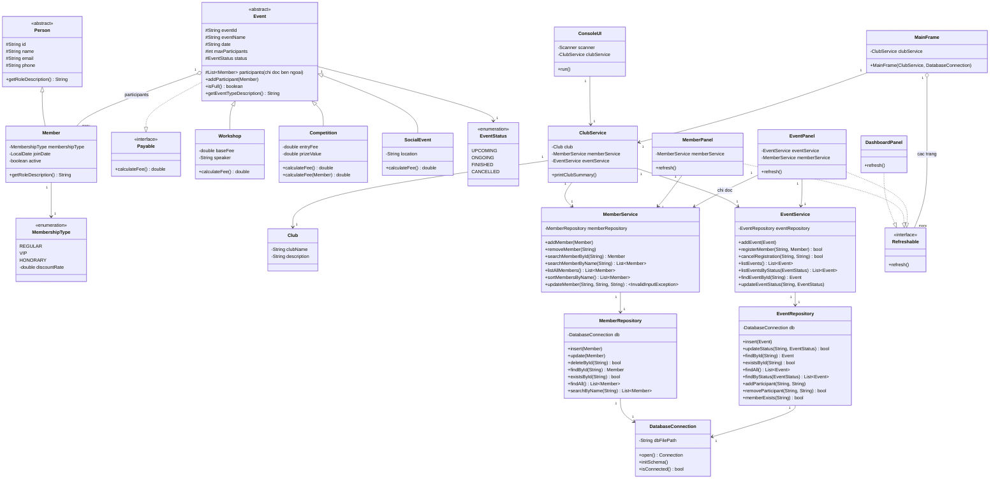

# Class Diagram

## Giải thích quan hệ chính

- **Inheritance**: `Member` kế thừa `Person`; `Workshop`, `Competition`, `SocialEvent` kế thừa `Event`.
- **Interface**: `Event` implement `Payable` → mỗi loại sự kiện override `calculateFee()` khác nhau (Polymorphism). `DashboardPanel`/`MemberPanel`/`EventPanel` cùng implement `Refreshable` → `MainFrame` gọi `refresh()` qua interface mà không cần biết bên trong là màn hình nào (Polymorphism ở tầng giao diện).
- **Composition**: `Event` sở hữu danh sách `participants` (List&lt;Member&gt;).
- **Association**: `ClubService` giữ tham chiếu tới `Club`, `MemberService`, `EventService`; `Service` giữ tham chiếu tới `Repository` tương ứng (không sở hữu vòng đời chặt — `Repository` chỉ là cổng vào database, dữ liệu thật nằm ngoài chương trình).
- **Tách tầng repository**: `Service` chỉ biết gọi method trên `Repository` (ví dụ `memberRepository.findAll()`), không biết bên trong dùng SQLite hay bất kỳ cách lưu trữ nào khác — nhờ vậy đổi công nghệ lưu trữ sau này (nếu cần) chỉ phải viết lại `Repository`, không đụng đến `Service` hay `ui`.
