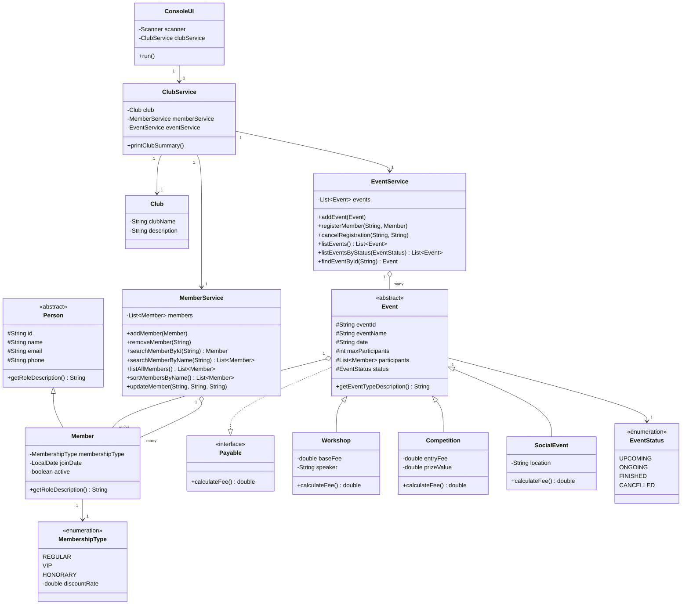

# Class Diagram

## Giải thích quan hệ chính

- **Inheritance**: `Member` kế thừa `Person`; `Workshop`, `Competition`, `SocialEvent` kế thừa `Event`.
- **Interface**: `Event` implement `Payable` → mỗi loại sự kiện override `calculateFee()` khác nhau (Polymorphism).
- **Composition**: `Event` sở hữu danh sách `participants` (List&lt;Member&gt;); `MemberService`/`EventService` sở hữu danh sách đối tượng quản lý — nếu service bị huỷ thì danh sách cũng mất theo.
- **Association**: `ClubService` giữ tham chiếu tới `Club`, `MemberService`, `EventService` để điều phối, nhưng không sở hữu vòng đời của chúng theo kiểu composition chặt.
