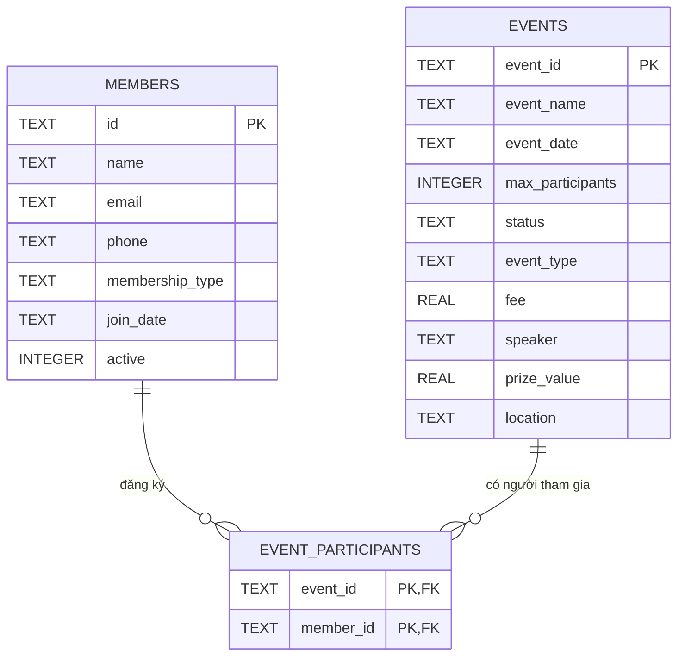

# Thiết kế Database (SQLite)

- **Công nghệ:** SQLite — toàn bộ dữ liệu nằm trong **một file** `data/club.db`, không cần cài server.
- **Tự tạo:** file và các bảng được tạo tự động ở lần chạy đầu (`DatabaseConnection.initSchema()`), an toàn khi chạy nhiều lần.
- **Không commit file `.db`** (đã nằm trong `.gitignore`) — mỗi máy tự sinh dữ liệu riêng. Muốn xóa sạch dữ liệu: tắt chương trình rồi xóa file `data/club.db`.
- **Xem dữ liệu trực tiếp:** dùng phần mềm miễn phí [DB Browser for SQLite](https://sqlitebrowser.org/) → *Open Database* → chọn `data/club.db`. Rất tiện để kiểm tra Repository ghi đúng chưa.

## Sơ đồ quan hệ

`EVENT_PARTICIPANTS` là **bảng trung gian** cho quan hệ nhiều-nhiều: một thành viên đăng ký nhiều sự kiện, một sự kiện có nhiều thành viên.

## Bảng `members`

| Cột | Kiểu | Ghi chú | Chuyển đổi trong Java |
|---|---|---|---|
| `id` | TEXT, khóa chính | `COLLATE NOCASE` → `M1` và `m1` là **cùng một ID** | `String` |
| `name` | TEXT, bắt buộc | | `String` |
| `email` | TEXT, bắt buộc | | `String` |
| `phone` | TEXT | có thể rỗng | `String` |
| `membership_type` | TEXT, bắt buộc | `REGULAR` / `VIP` / `HONORARY` | `MembershipType.name()` ↔ `MembershipType.valueOf(...)` |
| `join_date` | TEXT, bắt buộc | dạng ISO `2026-09-28` | `LocalDate.toString()` ↔ `LocalDate.parse(...)` |
| `active` | INTEGER, mặc định 1 | 1 = hoạt động, 0 = ngừng | `boolean` ↔ `1/0` |

## Bảng `events`

Cả 3 loại sự kiện nằm chung **một bảng**, phân biệt bằng cột `event_type`. Cột không dùng cho loại đó để `NULL`.

| Cột | Kiểu | Ghi chú |
|---|---|---|
| `event_id` | TEXT, khóa chính | `COLLATE NOCASE` |
| `event_name` | TEXT, bắt buộc | |
| `event_date` | TEXT, bắt buộc | lưu nguyên chuỗi `dd/MM/yyyy` như model hiện tại |
| `max_participants` | INTEGER, bắt buộc | |
| `status` | TEXT, bắt buộc | `EventStatus.name()`: `UPCOMING` / `ONGOING` / `FINISHED` / `CANCELLED` |
| `event_type` | TEXT, bắt buộc | `WORKSHOP` / `COMPETITION` / `SOCIAL` |
| `fee` | REAL | Workshop → `baseFee`; Competition → `entryFee`; Social → `NULL` |
| `speaker` | TEXT | chỉ Workshop |
| `prize_value` | REAL | chỉ Competition |
| `location` | TEXT | chỉ SocialEvent |

**Cách đọc/ghi theo loại:**

| `event_type` | Lớp Java khi đọc lên | Cột được dùng |
|---|---|---|
| `WORKSHOP` | `new Workshop(id, name, date, max, fee, speaker)` | `fee`, `speaker` |
| `COMPETITION` | `new Competition(id, name, date, max, fee, prize_value)` | `fee`, `prize_value` |
| `SOCIAL` | `new SocialEvent(id, name, date, max, location)` | `location` |

Sau khi tạo đối tượng phải gọi `event.setStatus(...)` để gán đúng trạng thái đã lưu (constructor luôn đặt `UPCOMING`).

> **Vì sao gộp một bảng thay vì 3 bảng?** Đơn giản, ít `JOIN`, dễ giải thích khi bảo vệ. Đánh đổi: có vài cột `NULL`. Với quy mô đồ án, đây là lựa chọn hợp lý; nếu sau này thêm nhiều loại sự kiện với nhiều cột riêng thì mới cần tách bảng.

## Bảng `event_participants`

| Cột | Ghi chú |
|---|---|
| `event_id` | khóa ngoại → `events(event_id)`, `ON DELETE CASCADE` |
| `member_id` | khóa ngoại → `members(id)`, `ON DELETE CASCADE` |
| (`event_id`, `member_id`) | khóa chính kép → **không thể đăng ký trùng** cùng một người vào cùng một sự kiện |

`ON DELETE CASCADE`: xóa một thành viên thì các dòng đăng ký của họ tự biến mất, không cần code xóa tay.

## Quy tắc viết Repository (bắt buộc cho cả nhóm)

1. **Luôn dùng `PreparedStatement` với dấu `?`**, tuyệt đối không nối chuỗi vào câu SQL (chống SQL Injection).
2. **Luôn dùng try-with-resources** cho `Connection`, `PreparedStatement`, `ResultSet` để tự đóng.
3. **Bọc `SQLException` thành `DatabaseException`** (unchecked) — mẫu code có sẵn trong Javadoc của `DatabaseConnection`.
4. **Repository chỉ đọc/ghi dữ liệu.** Kiểm tra nghiệp vụ (trùng ID, sự kiện đầy...) vẫn nằm ở Service.
5. Truy vấn tìm không thấy → trả `null` (với `findById`) hoặc danh sách rỗng (với `findAll`), **không** ném exception.

## Câu hỏi có thể bị hỏi khi bảo vệ

- **Vì sao dùng SQLite?** Là DB thật (SQL chuẩn) nhưng chỉ là một file, không cần cài server → dễ demo trên bất kỳ máy nào.
- **`PreparedStatement` khác `Statement` chỗ nào?** Tham số truyền qua `?` nên dữ liệu người dùng không bao giờ bị hiểu là lệnh SQL → chống SQL Injection.
- **Vì sao `DatabaseException` là unchecked?** Lỗi DB không phải lỗi nhập liệu của người dùng, tầng nghiệp vụ không xử lý được; để unchecked thì chữ ký method không phải thêm `throws SQLException` khắp nơi, giao diện chỉ cần bắt ở một chỗ.
- **Vì sao tách `Repository` khỏi `Service`?** Mỗi lớp một trách nhiệm: Repository biết *lưu ở đâu* (SQL), Service biết *luật nghiệp vụ*. Đổi cách lưu trữ chỉ sửa Repository, không đụng Service và giao diện.
